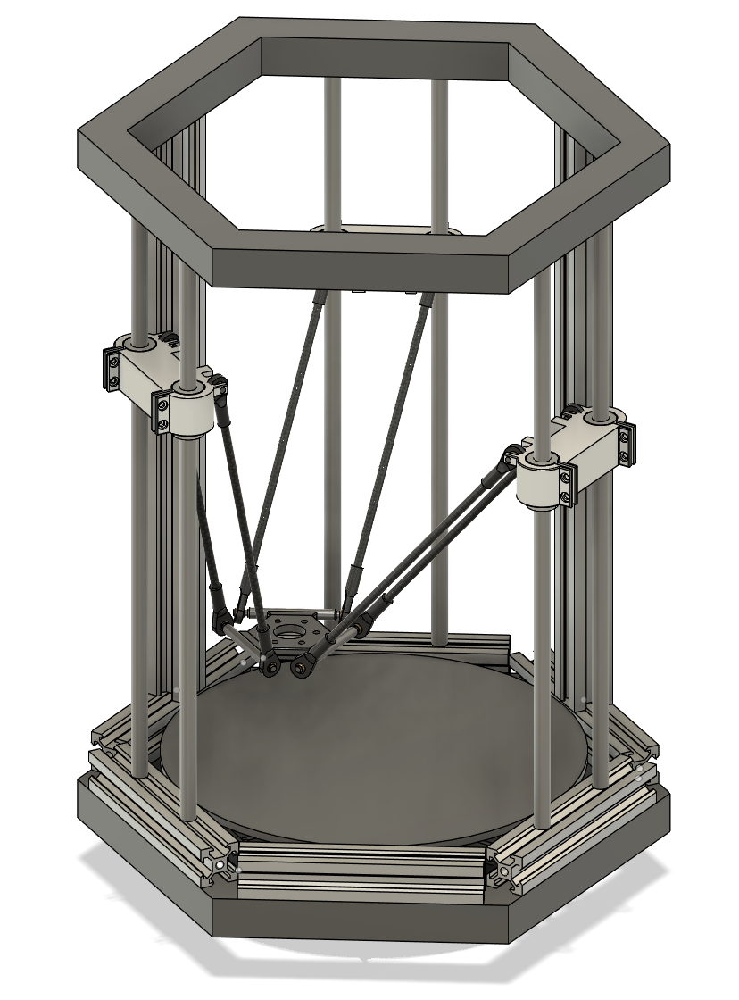

# gibsonpuckett.github.io

## Projects
### GOLD-P : 

- A low-cost, open source 3D printer design
- links

### Project 2: 
- Description
- liks
  
### Project 3:
- Description
- liks

# Education
Bachelors of Science, Electrical Engineering
Cal Poly, SLO
3.4 GPA

# Experience
- NASA Ames Research Center, June 2023 - PRESENT
- Electrical Lead, Cal Poly Prototype Vehicles Laboratory
